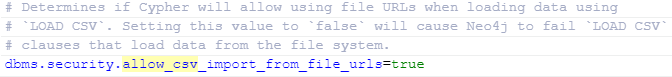

# Database Files

## The initial approach (IMDB Datasets)

  IMDB's curated datasets are used for initial loading and visualization of data, which can be located [here](https://datasets.imdbws.com/).
  These are **.tsv** files, or tab-separated values but will be converted to **.csv**, or comma-separated values through a script, and imported into the database.
  The script used to convert these is located [here](https://github.com/jeremysq/Neo4jDocs/blob/master/apps/Scripts/tsv_to_csv.py).

  After conversion, many of these entities contained multiple values, which led to unsuccessful results when importing the records. Due to this inconvenience, other Neo4j recommended datasets have been decided to be used.

## Neo4j Provisioned Datasets

  For now, experiments are done using the [Game Of Thrones Characters Dataset](https://raw.githubusercontent.com/mathbeveridge/asoiaf/master/data/asoiaf-all-edges.csv), which includes all characters. In addition to this, the [Game of Thrones Centralites Dataset](https://raw.githubusercontent.com/johnymontana/neovis.js/master/examples/data/got-centralities.csv) is also recommended to use as the PageRank algorithm has already been conducted to create centralities and community detection results.

## Allowing Local Importing of CSV Files

  In order to import local CSV files, the Neo4j instance must be pre-configured to allow for local files to be used, which by default, is not allowed. In the configuration file of the database, **neo4j.conf**, the following line needs to be commented out to allow for this feature. If deploying this application from the Docker hosted server from [here](https://github.com/jeremysq/Neo4jDocs/tree/master/apps/Server), then modifying the configuration file should not be necessary.

  

