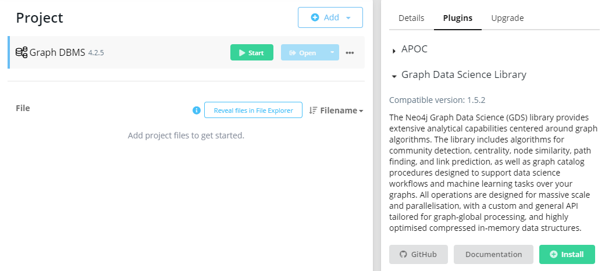

# Usage

 This section involves the basic overview of the approaches to take into consideration when developing in Neo4j's Graph Database Library. To install the Graph Database Library, the best way to do so in the Neo4j interactive environment is through the **Plugins** section in the Neo4j Browser:
 
 
 For additional functionality, it is also advised to install the APOC (Awesome Procedures on Cypher) module to allow for additional query utility with files on startup of a Neo4j instance. This can be installed within the same Plugins interface.

 If running within a **Docker** instance, you can add the following environment variable to your Docker instance by adding the following environment variable to either the <code>build</code>, or <code>run</code> step:

    NEO4JLABS_PLUGINS='["graph-data-science", "apoc"]'

 These changes have already been implemented during the <code>build</code> process of the Docker server provided in this repository.

## Phases
  
  Similar to web application development, there are production and development phases when using Neo4j's Graph Database Library. During the development phase, graph projections and algorithms are determined, which are then stored in memory. In the production phase, Neo4j is configured to run these algorithms developed from the building phase. From the Neo4j documentation, the following graphic gives a general overview:

  

## Projections

  When algorithms are run, it is actually using a projection of the graph data model instantiated by Neo4j. A projection can be seen as an overview of the stored graph, which only contains the most relevant, topological, and property information. These projections are stored entirely in memory, which are helped by compressed data structures optimized for topology and propertly lookup operations.
  Projections are managed by a **graph catalog**, which is a concept maintained by Neo4j that ties projections by name. Once an instance of Neo4j is terminated, the graph catalog is also deleted, meaning that they must be re-created once the instance is taken down.
  There are two projections provided by Neo4j:
  1. Native Projection
  2. Cypher Projection

  A brief contrast between both projections is that native projections have better performance, while Cypher projections are more flexible. However, it is recommended that when possible, to use native projections to save memory usage. When running commands and functions in Cypher to utilize projections, the Graph Database Systems library **(gds)** of functions and syntax are used.

  ### Native Projections

  Native Projections allow graphs to be projected from Neo4j into memory. They require three mandatory arguments:
  1. Graph Name - The name which the graph is stored in the catalog
  2. Node Projection - A mapping of Neo4j nodes into the in-memory graph.
  3. Relationship Projection - A mapping defining how a subset of Neo4j relationships is projected into the in-memory graph.

  Generating too many projections could result in excessive memory usage, so it is advised to compose proper data structures by combining relationships instead of creating new ones every time. Native projections support multiple relationship types by filtering through individual algorithm executions. 

  ### Cypher Projection
  
  Cypher Projections have the capabilities of forming the graph from data that exists only at the query time. These also require three essential arguments:
  1. Graph Name - The name which the graph is stored in the catalog.
  2. Node Query - A cypher query to porject the nodes.
  3. Relationship Query - A cypher query to project the relationships.

  Since these parameters are using Cypher's querying language, it is optimized to initially run faster than native projections. In contrast to native projections, loading multiple relationship types is done by returning the type in the query itself. Relationships created by these projections are projected as a `NATURAL` orchestration, meaning that it is the same way as it is stored in Neo4j. If this is not the ideal way of portraying the data, then looking towards using native projections will be the preferred approach.

## Memory
  
  Most of the memory allocation will be related to the in-memory graph model, which stores the projections previously mentioned. The graph model contains three types of data:
  1. Node IDs
  2. Relationships
  3. Weights

  Weights are an array-like data structure stored as doubles. Estimating memory can be done to ensure that certain algorithms by using the <code>.estimate</code> function when conducting a Cypher query that supports this mode. Examples of these Cypher queries can be found [here](https://github.com/jeremysq/Neo4jDocs/tree/master/cypher/memory).
